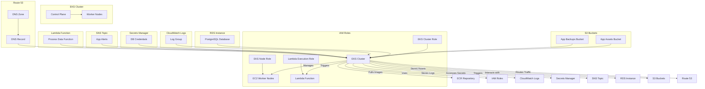

```mermaid
graph TD
    A[EKS Cluster] -->|Manages| B[EC2 Worker Nodes]
    A -->|Pulls Images| C[ECR Repository]
    A -->|Uses| D[IAM Roles]
    A -->|Stores Logs| E[CloudWatch Logs]
    A -->|Accesses Secrets| F[Secrets Manager]
    A -->|Triggers| G[SNS Topic]
    A -->|Interacts with| H[RDS Instance]
    A -->|Stores Assets| I[S3 Buckets]
    A -->|Triggers| J[Lambda Function]
    A -->|Routes Traffic| K[Route 53]

    subgraph "EKS Cluster"
        A1[Control Plane]
        A2[Worker Nodes]
        A1 --> A2
    end

    subgraph "IAM Roles"
        D1[EKS Cluster Role]
        D2[EKS Node Role]
        D3[Lambda Execution Role]
        D1 --> A
        D2 --> B
        D3 --> J
    end

    subgraph "S3 Buckets"
        I1[App Assets Bucket]
        I2[App Backups Bucket]
        I1 --> A
        I2 --> A
    end

    subgraph "RDS Instance"
        H1[PostgreSQL Database]
        H1 --> A
    end

    subgraph "CloudWatch Logs"
        E1[Log Group]
        E1 --> A
    end

    subgraph "Secrets Manager"
        F1[DB Credentials]
        F1 --> A
    end

    subgraph "SNS Topic"
        G1[App Alerts]
        G1 --> A
    end

    subgraph "Lambda Function"
        J1[Process Data Function]
        J1 --> A
    end

    subgraph "Route 53"
        K1[DNS Zone]
        K2[DNS Record]
        K1 --> K2
        K2 --> A
    end
```