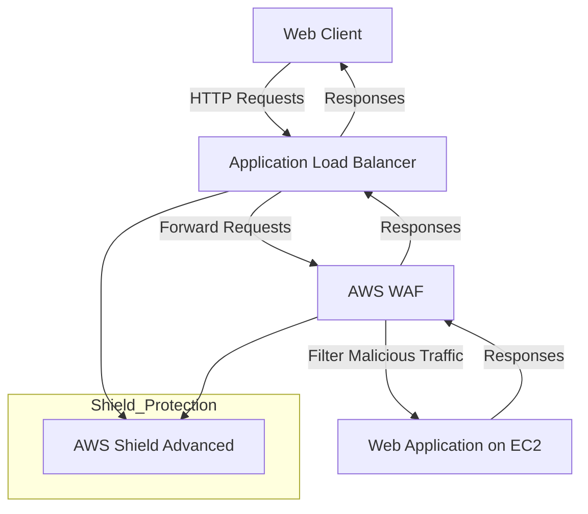

```mermaid
graph TD
    A[Web Client] -->|HTTP Requests| B[Application Load Balancer]
    B -->|Forward Requests| C[AWS WAF]
    C -->|Filter Malicious Traffic| D[Web Application on EC2]
    D -->|Responses| C
    C -->|Responses| B
    B -->|Responses| A
    
    subgraph Shield_Protection
        E[AWS Shield Advanced]
    end

    B --> E
    C --> E
```