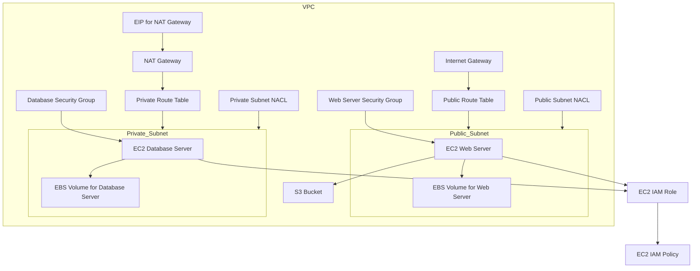

Explanation
VPC: Contains the overall network environment.
Internet Gateway (IGW): Allows internet access to resources in the public subnet.
NAT Gateway: Enables instances in the private subnet to access the internet without exposing them to inbound internet traffic.
Route Tables: Configured for public and private subnets to manage traffic flow.
Security Groups: Applied to EC2 instances for traffic control.
Network ACLs: Provide an additional layer of security at the subnet level.
EC2 Instances: Deployed in public (web servers) and private (database servers) subnets.
EBS Volumes: Attached to EC2 instances for persistent storage.
S3 Bucket: Stores static assets.
IAM Roles and Policies: Manage permissions for EC2 instances and users.