```mermaid
graph TD
  subgraph Data_Ingestion
    Kinesis[Amazon Kinesis Data Streams]
    S3_Raw[Amazon S3 - Raw Data]
  end

  subgraph Data_Processing
    Lambda[AWS Lambda]
    EMR[Amazon EMR]
    Glue[AWS Glue]
  end

  subgraph Data_Storage
    S3_Processed[Amazon S3 - Processed Data]
    Redshift[Amazon Redshift]
  end

  subgraph Data_Analysis
    Athena[Amazon Athena]
    QuickSight[Amazon QuickSight]
  end

  subgraph Security_and_Access_Control
    IAM_Roles[IAM Roles and Policies]
    Security_Groups[Security Groups]
    NACLs[Network ACLs]
  end

  subgraph Monitoring_and_Logging
    CloudWatch[Amazon CloudWatch]
    CloudTrail[AWS CloudTrail]
  end

  Kinesis -->|Ingests Data| S3_Raw
  S3_Raw -->|Triggers| Lambda
  Lambda -->|Processes Data| S3_Processed
  S3_Raw -->|Batch Processing| EMR
  S3_Raw -->|ETL Operations| Glue
  EMR -->|Stores Processed Data| S3_Processed
  Glue -->|Stores Processed Data| S3_Processed
  S3_Processed -->|Stores Data| Redshift
  Athena -->|Queries Data| S3_Processed
  QuickSight -->|Visualizes Data| Redshift
  IAM_Roles -->|Manages Access| Kinesis
  IAM_Roles -->|Manages Access| Lambda
  IAM_Roles -->|Manages Access| EMR
  IAM_Roles -->|Manages Access| Glue
  IAM_Roles -->|Manages Access| S3_Raw
  IAM_Roles -->|Manages Access| S3_Processed
  IAM_Roles -->|Manages Access| Redshift
  IAM_Roles -->|Manages Access| Athena
  IAM_Roles -->|Manages Access| QuickSight
  Security_Groups -->|Secures| Kinesis
  Security_Groups -->|Secures| Lambda
  Security_Groups -->|Secures| EMR
  Security_Groups -->|Secures| Glue
  Security_Groups -->|Secures| S3_Raw
  Security_Groups -->|Secures| S3_Processed
  Security_Groups -->|Secures| Redshift
  Security_Groups -->|Secures| Athena
  Security_Groups -->|Secures| QuickSight
  NACLs -->|Secures| Kinesis
  NACLs -->|Secures| Lambda
  NACLs -->|Secures| EMR
  NACLs -->|Secures| Glue
  NACLs -->|Secures| S3_Raw
  NACLs -->|Secures| S3_Processed
  NACLs -->|Secures| Redshift
  NACLs -->|Secures| Athena
  NACLs -->|Secures| QuickSight
  CloudWatch -->|Monitors| Kinesis
  CloudWatch -->|Monitors| Lambda
  CloudWatch -->|Monitors| EMR
  CloudWatch -->|Monitors| Glue
  CloudWatch -->|Monitors| S3_Raw
  CloudWatch -->|Monitors| S3_Processed
  CloudWatch -->|Monitors| Redshift
  CloudWatch -->|Monitors| Athena
  CloudWatch -->|Monitors| QuickSight
  CloudTrail -->|Logs| Kinesis
  CloudTrail -->|Logs| Lambda
  CloudTrail -->|Logs| EMR
  CloudTrail -->|Logs| Glue
  CloudTrail -->|Logs| S3_Raw
  CloudTrail -->|Logs| S3_Processed
  CloudTrail -->|Logs| Redshift
  CloudTrail -->|Logs| Athena
  CloudTrail -->|Logs| QuickSight
```

Explanation
Data Ingestion: Data is ingested in real-time using Amazon Kinesis Data Streams and stored in Amazon S3 (Raw Data).
Data Processing: AWS Lambda processes data in real-time, while Amazon EMR and AWS Glue handle batch processing and ETL operations.
Data Storage: Processed data is stored in Amazon S3 (Processed Data) and Amazon Redshift for scalable storage and fast querying.
Data Analysis: Amazon Athena queries the processed data in S3, and Amazon QuickSight visualizes the data stored in Redshift.
Security and Access Control: IAM roles and policies manage access to all services, while security groups and network ACLs ensure secure access to resources.
Monitoring and Logging: Amazon CloudWatch monitors the performance and health of all services, and AWS CloudTrail logs user activity and API usage.