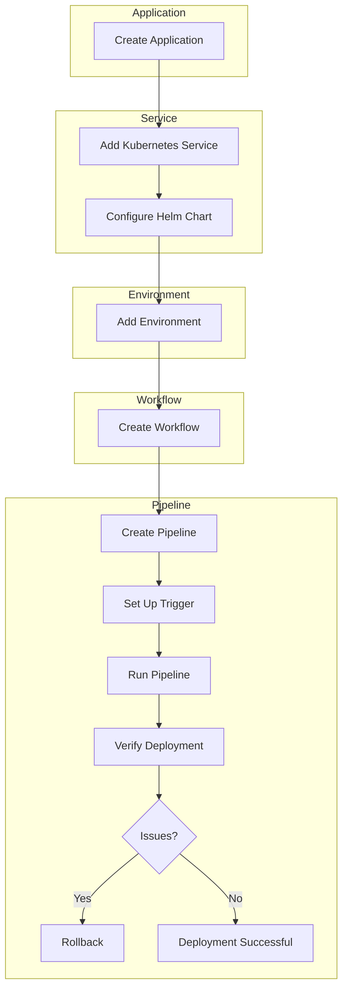

```mermaid
graph TD
    A[Create Application] --> B[Add Kubernetes Service]
    B --> C[Configure Helm Chart]
    C --> D[Add Environment]
    D --> E[Create Workflow]
    E --> F[Create Pipeline]
    F --> G[Set Up Trigger]
    G --> H[Run Pipeline]
    H --> I[Verify Deployment]
    I --> J{Issues?}
    J -->|Yes| K[Rollback]
    J -->|No| L[Deployment Successful]

    subgraph Application
        A
    end

    subgraph Service
        B
        C
    end

    subgraph Environment
        D
    end

    subgraph Workflow
        E
    end

    subgraph Pipeline
        F
        G
        H
        I
        J
        K
        L
    end

```